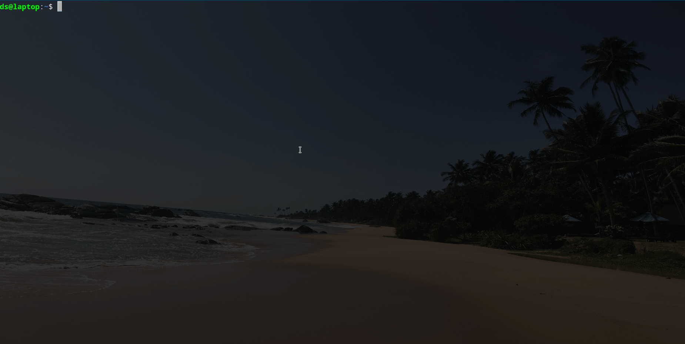

# KLS

## Description

`kls` is a cli wrapper around `kubectl` written in rust.

## Key bindings

### For kubectl

- `Ctrl+y` - get **Y**aml of resource
- `Ctrl+d` - **D**escribe resource
- `Ctrl+e` - **E**dit resource
- `Ctrl+l` - **L**ogs of pod
- `Ctrl+x` - e**X**ec into pod
- `Ctrl+n` - **N**etwork debug of pod (with nicolaka/netshoot container attached)
- `Ctrl+a` - **A**ccess logs of istio sidecar
- `Ctrl+p` - exec into istio-**P**roxy sidecar
- `delete` - delete resource

### Other:

- `/` - enter filter mode
- `Escape` or `q` - exit filter mode or `kls` itself
- `Backspace` - remove letter from filter
- `TAB`, arrow keys, `PgUp`, `PgDn`, `Home`, `End` - navigation
- `Ctrl+r` - reload namespaces and kinds
- `Ctrl+s` - switch to another context



## Installation

### Dependencies

`batcat`:

```
sudo apt install bat -y
```

For `jaq` and `hl` installation refer to respective repositories:

- [jaq](https://github.com/01mf02/jaq)
- [hl](https://github.com/pamburus/hl)

For kubectl installation refer to [kubectl installation guide](https://kubernetes.io/docs/tasks/tools/install-kubectl/)

### kls installation

```
cargo install --git https://github.com/digitalstudium/kls
```
